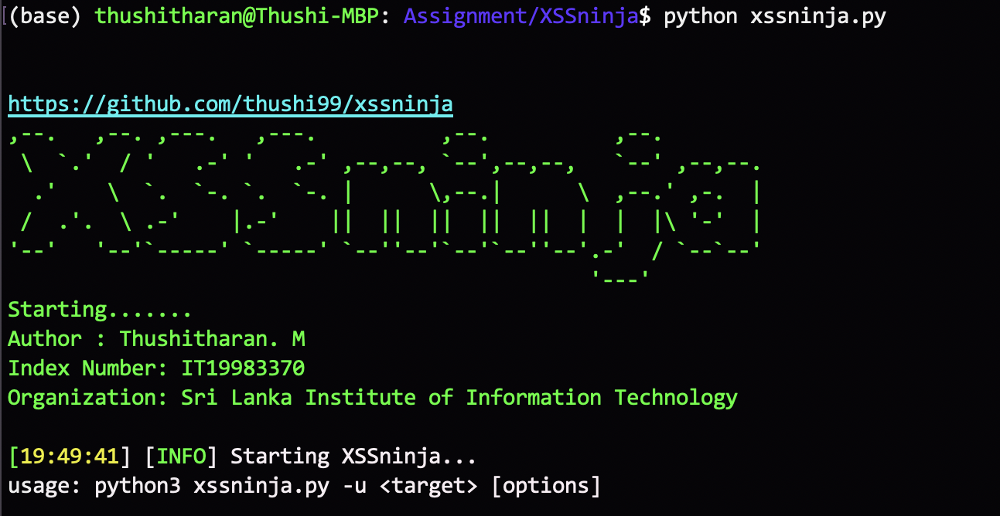

## Installing 

Requirements: <br/>

<li> BeautifulSoup4 </li>

```bash
pip install bs4
```
<li> requests </li> 

```bash
pip install requests
```
<li> python 3.7 </li>
<br/>
Commands:

```bash
git clone https://github.com/thushi99/xssninja.git
chmod 777 -R xssninja
cd xssninja
python3 xssninja.py --help 
```
## Usage
Basic usage:

```bash
python3 xssninja.py -u http://testphp.vulnweb.com
```
<br/>
Advanced usage:

```bash
python3 xssninja.py --help
```

## Features

* crawling all links on a website ( crawler engine )
* POST and GET forms are supported
* Multiprocessing support.


## Screenshot



## Version

Version 1.0